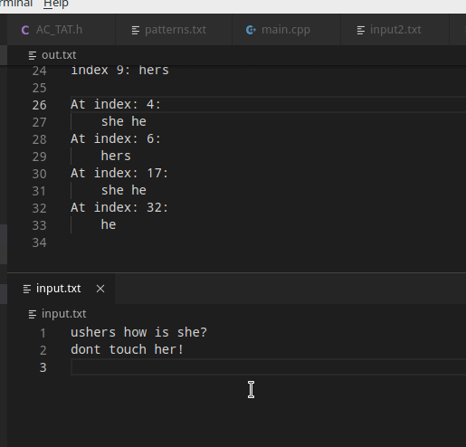

# AC算法 多模式匹配

[TOC]

## 任务：基于双数组-AC算法

1. 双数组-自动机的预处理：Next表、Base表、Check表、失效函数、输出函数构建（这里应该指的是<u>三数组</u>，双数组中Next表和Base表合为一个Base表）
2. 利用构建的自动机扫描目标文件
   * 扫描文件发现命中模式，需明确给出命中的模式和该模式在文件中的位置
   * 如命中多个模式，需要全部列出
3. 要求：
   * 实验数据准备。实验数据应简单实用：利用ASCII字符集作为输入集，不考虑多字节编码的中文、英文字符集。模式和待匹配文本可以只包含英文。
   * 程序的输入部分（模式、待匹配文本）需以文件方式提供或其它非固定的输入途径。
   * 实验结果和实验数据一起给出：包括设定的模式有哪些？Next表、Base表、Check表是什么？待匹配文本是什么？输出结果是什么。
   * 注意：仅给出匹配结果是不够的，必须在输入多模式后，给出Next表、Base表、Check表内容，Next表中空间占用的百分比

## 实现

### 基础介绍

* AC算法主要需要三个函数：转移函数、输出函数、失败函数。

* 而三个函数的基础，尤其是对转移函数（实际上可以说有了转移函数就有了自动机，有了自动机也有了转移函数）来说，在于自动机的构建（表示），比较直接的就是每个状态都保存对所有字符的转移情况，这样会占用`S*C`个指针大小（S是状态数，C是字符数），如果采用HashMap或许可以节省一些空间。

* 更好的办法就是采用双数组或者三数组方式表示这个自动机：

  1. 三数组方式 (Johnson1975, Aho+1985)

     * 如下面这个转移
  
   * 
  
     * ```c++
       // s状态遇到c字符转移到t状态 (正常情况，没有失败时)
       next[base[s] + c] = t; // next中存目的状态t
       check[base[s] + c] = s; // check中存源状态s
     ```
  
   * 也就是意味着base数组大小等于状态数，next和check数组一样大。
  
   * base是用来辅助索引next中的元素(相当于一个基础偏移量)，check是用来检验转移是否正确，next是核心，指明转移到的状态
  
     * 所以用上三个表的一次转移就是
  
       ```c++
       t = base[s] + c;
       
       if (check[t] == s)
           next_state = next[t];
       else
           fail... // 后面就会用失败函数进行转移
       ```
  
  2. 双数组方式 (Aoe1989)
  
     * 还是s到t的这个转移
     
     * 
     
     * ```c++
       // s状态遇到c字符转移到t状态 (正常情况，没有失败时)
       base[s] + c = t; // base与next数组合并为了一个base数组
       check[base[s] + c] = s; // check还是一样存源状态
       ```
     
     * （我其实没懂）这时就意味着base和check一样大，我对base数组这儿有疑问：
     
       * ```c++
         // 如果说2状态通过'a'转移到3状态，通过'c'转移到4状态，那么
         base[2] + 'a' = 3;
         base[2] + 'c' = 4;
         // 肯定是有问题的。。第一个式子等于3，那第二个肯定等于5了
         ```
     
     * 转移和上面三数组方式类似
     
       ```c++
       t = base[s] + c;
       
       if (check[t] == s)
           next_state = t; // 就这里不同
       else
           fail... // 后面就会用失败函数进行转移
       ```

* 如果几个函数都有了，那么匹配串的过程就是下面这么简单：

  ```c++
  void start_match(FILE *in, ostream &out) {
          unsigned char_read = 0;
          char c;
          int s = 0, t;
          while ((c=fgetc(in)) != EOF) {
              ++char_read;
  
              // s保存当前的状态号，t保存下一步的状态号
              t = g(s, c);
              while (t == -1) {
                  s = f(s);
                  t = g(s, c);
              }
  
              if (outputs[t].size() != 0){
                  out<<"At index: "<<char_read<<":\n\t";
                  o(t);
              }
  
              s = t;
          }
      }
  ```

### 总体流程

* 我采用的是三数组的实现方式，但和上面介绍的略有不同，就check数组不同

  ```c++
  // check数组我按照ppt中的方式，数组大小也是状态个数，所以s到t大致过程:
  t = next[base[s]+c];
  if (check[t] == s)
      next_state = t;
  else
      fail...
  ```

* 匹配过程就不说了，上面的代码很清楚，关键还是在初始化几个数组上（next, base, check, output, failure）:

  1. 采用先广遍历，使用一个队列，队列元素类型是pair<int, vector< Pattern > >

     * 该pair中first元素对应的是导致到达该状态的字符，比如1--'a'-->2（1识别'a'转移到2状态），那么2状态对应的元素的first值就是'a'

     * second值是该状态包含的字符串：Pattern类型中含有该串以及即将识别的串的下标。如0状态中有her, she两个模式串，那么0状态对应的second值就是her和she两个pattern，下标都是0，因为还没有识别字符

       ```c++
       class Pattern {
       public:
           string str;
           int idx;
           
           Pattern(string buffer, int index):str(buffer), idx(index) { }
       
       	bool operator< (const Pattern& rhs) const{
       		return this->str < rhs.str;
       	}
       };
       ```

  2. 开始队列中仅一个根节点，对应状态0

  3. 循环取出队首元素，更新相关数组，直到队列为空

     * 先**初步**更新当前状态对应的outputs数组，即检查该队列元素的模式串中是否有识别到末尾的，不能再读入更多的字符，这样的串就是要输出的串

     * 然后更新当前状态对应的failures数组，利用check数组可以找到当前状态的上一状态，如果上一状态是0，则failures中直接填0，如果不是，则循环向上，利用其failures值更新，具体过程类似下图（注意到这里**也可能添加outputs值**）

       

     * 下面寻找next数组中合适的开始填充的位置，要求孩子节点的转移字符都能放下，不和以前的冲突
     * 找到填充位置后可以更新base值，同时为孩子节点更新check值，然后向队列中放入孩子节点（这里具体实现可以见代码，有详细注释，更清楚）

### 关键函数

* 最关键的函数就是上面说的那个初始化这些数组的函数，具体可以见源代码中的构造函数；然后就是三个使用这些数组的函数: g, o, f

1. g -- 转向函数goto

   ```c++
   int g(int s, int c) {
       // 检查越界
       if (base.size() <= s) return -1;
       int t_idx = base[s]+c;
       if (t_idx<next.size() && check[next[t_idx]] == s) {
           // 状态转移成功
           return next[t_idx];
       }
       // 状态转移失败(s是0的话，失败也就直接不算失败，反正转向0)
       return s==0?0:-1;
   }
   ```

   base数组负责基础偏移，next数组利用基础偏移加上字符的编码值得到下一状态号，利用check数组检查该状态号是否正确，正确则转移成功，否则失败，返回-1

2. o -- 输出函数output

   ```c++
   // 失效函数failure
   int f(int s) {
       return failures[s];
   }
   ```

   直接输出failures数组值

3. f -- 失效函数failure

   ```c++
   void o(int s) {
       // 注意这里没有判断output[s]大小是否为0
       for (vector<string>::iterator it = outputs[s].begin(); it != outputs[s].end(); it++){
           cout<<*it<<" ";
       }
       cout<<endl;
   }
   ```

   直接遍历outputs中的元素，输出，空格分割，最后输出一个换行

## 测试

1. 简单测试

   ```shell
   $ cat patterns.txt
   he
   she
   hers
   his
   
   $ cat input.txt
   ushers how is she?
   dont touch her!
   ```

   

   

2. 用vimtutor的文本内容测试

   * 模式串:

     ```
      this
      who
      that
      the
      next
      Vim
      time
      commands
     ```

   * 结果

     

## 总结

​	通过本次实验，对AC算法与多模式匹配有了更加深刻的理解，理解了如何利用压缩状态转移表的方式优化AC算法的空间利用。

## references

* [An Implementation of Double-Array Trie](https://linux.thai.net/~thep/datrie/datrie.html) 最好的应该是这个，英文，包括DAT和TAT(双数组和三数组)
* [基于双数组的AC匹配算法学习](https://blog.csdn.net/choumin/article/details/51106780) 这个好，双数组AC，步骤、关键实现讲解不错
* [双数组Trie树 (Double-array Trie) 及其应用](https://www.cnblogs.com/en-heng/p/6265256.html) 介绍不错，逐渐加深，能更详细就完美了

