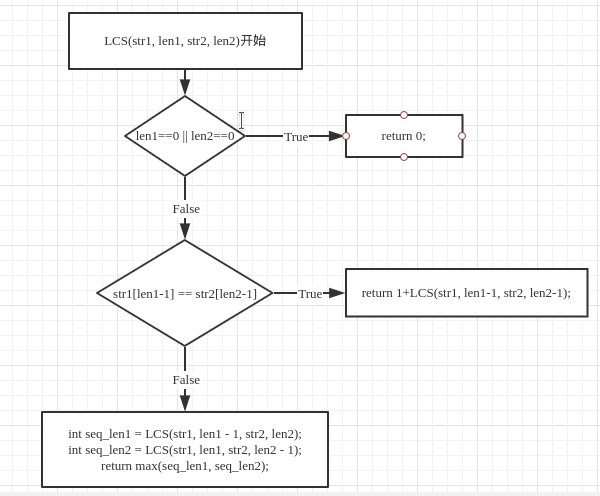
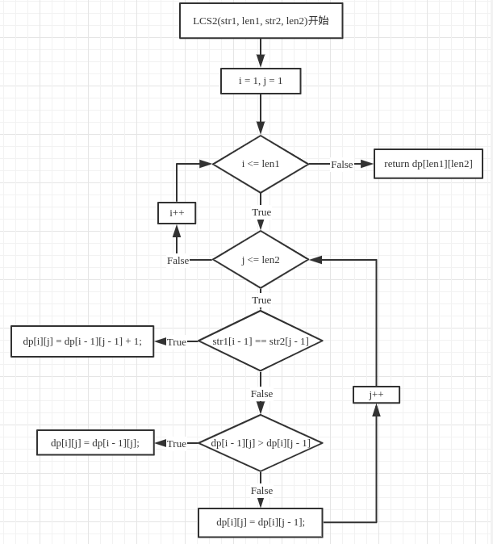
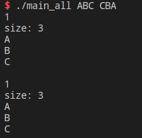
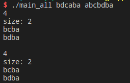

# 最长公共子序列

## 要求

1. 数据准备，利用ASCII字符集作为输入集
2. 程序的
   * 输入部分：2个字符串。
   * 输出部分：这两个字符串的最长公共子序列，**如有多个一同给出**

## 实现

### 总体流程

* 递归方式（这里为了易于理解算法过程，省去了保留中间结果的部分，详细内容可以见**关键函数**）

  

* 递推方式

  

### 关键函数

* 递归实现代码(函数LCS)

  ```c++
  // 递归
  int LCS(const char *str1, int len1, const char *str2, int len2)
  {
      if (len1 == 0 || len2 == 0)
          return 0;
  
      if (dp[len1][len2] != -1)
          return dp[len1][len2];
  
      if (str1[len1 - 1] == str2[len2 - 1])
      {
          // 这两行仅为输出所有最长公共子序列时需要，仅一个最长公共子序列不需要
          dp[len1 - 1][len2] = LCS(str1, len1 - 1, str2, len2);
          dp[len1][len2 - 1] = LCS(str1, len1, str2, len2 - 1);
  
          dp[len1 - 1][len2 - 1] = LCS(str1, len1 - 1, str2, len2 - 1);
          // 3表示左上
          result[len1][len2] = 3;
          return dp[len1][len2] = 1 + dp[len1 - 1][len2 - 1];
      }
      else
      {
          int seq_len1 = LCS(str1, len1 - 1, str2, len2);
          int seq_len2 = LCS(str1, len1, str2, len2 - 1);
          dp[len1 - 1][len2] = seq_len1;
          dp[len1][len2 - 1] = seq_len2;
          if (seq_len1 > seq_len2)
          {
              result[len1][len2] = 1; // 1表示上
              return dp[len1][len2] = seq_len1;
          }
          else
          {
              result[len1][len2] = 2; // 2表示左
              return dp[len1][len2] = seq_len2;
          }
      }
  }
  ```

  程序分两大分支，一是如果当前两个子串的最后一个字符相等，则最长长度为`1+两个串都去掉最后一个字符的LCS长度`（这里直接递归调用即可）；另一个是当这两个末尾字符不同时，分别检查串1少最后一个字符或串2少最后一个字符下，LCS长度哪个更大，取较大者更新当前的LCS长度。

* 递推实现伪代码(函数LCS2)

  ```c++
  // 递推
  int LCS2(const char *str1, int len1, const char *str2, int len2)
  {
      for (int i = 1; i <= len1; ++i)
      {
          for (int j = 1; j <= len2; ++j)
          {
              if (str1[i - 1] == str2[j - 1])
              {
                  dp[i][j] = dp[i - 1][j - 1] + 1;
                  // 3表示左上
                  result[i][j] = 3;
              }
              else if (dp[i - 1][j] > dp[i][j - 1])
              {
                  dp[i][j] = dp[i - 1][j];
                  // 1表示上，上面的dp值更长
                  result[i][j] = 1;
              }
              else
              {
                  dp[i][j] = dp[i][j - 1];
                  // 2表示左
                  result[i][j] = 2;
              }
          }
      }
      return dp[len1][len2];
  }
  ```

  递归是从后往前（最终状态到初始状态），比较符合正常思维，易于理解，递推则是从前往后（最初状态到最终状态）。从第一行到len1行逐行更新dp数组的值，最终求到的`dp[len1][len2]`即为需要的LCS长度。

* print_sequence 输出一个最长子序列(main.cpp)

  ```c++
  // 输出一个最长子序列
  void print_sequence(int len1, int len2)
  {
      if (len1 == 0 || len2 == 0)
          return;
      switch (result[len1][len2])
      {
      case 1:
          print_sequence(len1 - 1, len2);
          break;
      case 2:
          print_sequence(len1, len2 - 1);
          break;
      case 3:
          print_sequence(len1 - 1, len2 - 1);
          cout << str1[len1 - 1];
          break;
      }
  }
  ```

  这里直接使用保存的移动过程数组`result`进行移动，并对应输出字符，最终输出的是某一个最长子序列

* get_all_sequence 获取所有最长子序列(main_all.cpp)

  ```c++
  // 获取所有最长公共子序列
  // 测试 bdcaba abcbdba
  set<string> get_all_sequence(int len1, int len2)
  {
      set<string> s;
      char buf[2] = {0};
      if (len1 == 0 || len2 == 0)
          return set<string>();
      
      if (dp[len1][len2] == dp[len1][len2-1]) {
          set<string> tmp = get_all_sequence(len1, len2-1);
          s.insert(tmp.begin(), tmp.end());
      }
  
      if (dp[len1][len2] == dp[len1-1][len2]) {
          set<string> tmp = get_all_sequence(len1-1, len2);
          s.insert(tmp.begin(), tmp.end());
      }
  
      if (dp[len1][len2] == dp[len1-1][len2-1]) {
          set<string> tmp = get_all_sequence(len1-1, len2-1);
          s.insert(tmp.begin(), tmp.end());
      } else if (dp[len1][len2] == dp[len1-1][len2-1] + 1 && str1[len1-1]==str2[len2-1]) 	   {
          set<string> tmp = get_all_sequence(len1-1, len2-1);
          buf[0] = str1[len1-1];
          string ss(buf);
          if (tmp.empty()) {
              s.insert(ss);
          } else {
              for (auto x: tmp) {
                  s.insert(x+ss);
              }
          }
      }
      return s;
  }
  ```

  这里明显区别就是首先没有直接输出，而是用一个`set<string> s`保存了序列；再一个区别就是这里没有使用result数组判定如何移动，而是利用原始的dp数组(两个子串的LCS长度)进行盘点往哪个方向移动可能得到最长的序列，然后递归调用，将几个子过程得到的序列汇总保存下来，最终返回给调用者。

## 测试

* 首先用"ABC"与"CBA"两个串进行测试，结果如下：最长公共子序列长为1，可能的序列有3个——"A"或"B"或"C"（上面是递归，下面是非递归）

  

* 再用一个稍复杂的两个串测试: "bdcaba"和"abcbdba"，结果如下：最长公共子序列长为4，可能的序列有2个——"bcba"或"bdba"（上面是递归，下面是非递归）

  

## 总结

​	对于最长公共子序列的求解，实现了**递归**与非递归(**递推**)两种方式，递归更加简洁易懂，但递推方式效率与资源占用上更好。

​	另外，实现了两种输出序列的方式：

​		一种是如果只需要**输出一个最长公共子序列**(print_sequence函数)，通过上面的递推或者递归过程先记录移动过程（从后向前），1表示上，2表示左，3表示左上。然后通过这个过程直接输出对应的字符即可

​		另一种是**输出所有最长公共子序列**的情况(get_all_sequence函数)，记录移动过程就没有必要了（记录的移动过程只是一种产生最长公共子序列的方式），通过在记录序列长度的二维数组dp中对所有可能的路径进行搜集，用set容器保存可能的序列（set中每个元素唯一），在main函数中最终输出所有的序列。