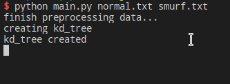
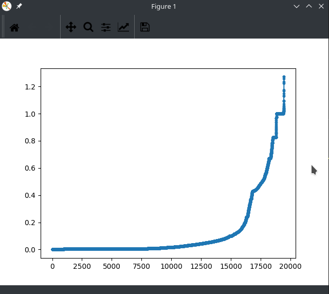
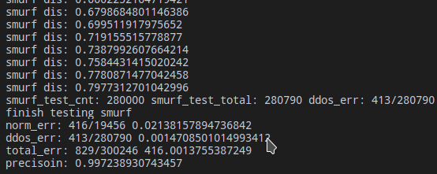

# 利用KD树进行异常检测

## 文件说明

```shell
$ tree . -L 1
.
├── images # 截图
├── kddcup.data_10_percent # 原始的数据文件
├── main.py # 主程序
├── normal.txt # process_data.py将正常数据提取到normal.txt
├── notes.md # 实验报告
├── process_data.py # 负责从原始数据文件中提取我们需要的数据
├── README.md # 本文件
└── smurf.txt # process_data.py将smurf数据提取到smurf.txt
```

## 运行示例

1. 提取需要的数据

   * ```shell
     $ python process_data.py kddcup.data_10_percent
     Processing file: kddcup.data_10_percent
     ```

2. 运行主程序

   * 创建kd树（传入提取的两个数据文件，将用normal.txt中60%的数据创建KD树）

   

   * 再用20%的normal数据作图

     

   * 最后输出测试结果（用20%的normal数据和所有异常数据测试）

     

