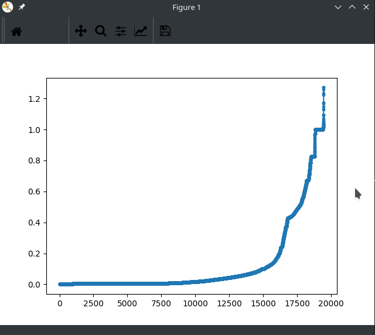

# KD树 - 异常检测

## 任务：基于KD树的网络流量异常检测

1. 利用KD树构建一个用于多维空间最邻近搜索的数据结构
2. 建立历史数据集合，格式化数据，采用**标准分割策略**，进行基于维度分割的KD树构建
3. 基于待检测数据X，利用构建好的KD树搜索，找出历史数据集合中与待检测数据X**最近的数据**；计算二者之间的**欧式距离**，与阈值对比，确定是否是异常数据点。
4. 要求：
   * 实验数据准备。利用KDD1999数据集提供的数据进行实验。选取部分正常数据作为训练集，选择部分攻击数据和剩下的正常数据作为测试集
   * 可以只选择流量属性集。可只针对DOS（smurf攻击即可）攻击进行异常检测，其他攻击不考虑
   * 利用标记为**NORMAL的数据建模（构建KD树）**。利用一部分标记为**NORMAL的数据和ATTACK数据作为测试数据**。

## 实现

### KD树基础

* 本质上KD树是一种二元搜索树，它通过超平面把一个空间递归划分为多个子空间来实现二叉搜索。

* KD树的每个节点对应多维空间一个矩形，根节点包含了所有的数据点，中间节点对应于被划分后的数据点的子集，超平面将节点不断进行划分，当节点中的数据个数小于某个实现设定阈值，划分就停止

* KD树的建立过程中，分割策略至关重要，本实验要求使用标准分割策略，比较简单，一些常见的策略有：

  * （本实验使用）标准分割策略：选取具有最大延展度的维作为分割维，将该维的中点定为分割点。--- 能保证最终得到的kd树的高度不超过$\log_2n$，但可能使划分后得到的超矩形具有过高的长宽比
  * 中点分割策略
  * 滑动中点分割策略

### 总体流程

* 流程图
  * 

1. 数据处理
   * 首先需要将需要的数据提取（分离出来），我用到的是原始数据中的\[23, 32)列，只挑选具有normal标签和smurf标签的数据
   * 数据的规格化：将有关属性数据按比例投射到特定小范围之中（试验中是投射到0~1）。是为防止在距离计算时某些取值范围过大的分量掩盖了其它分量的作用，使得算出的距离不能完全体现两个向量间的差异，最大最小规格化公式如下
     * 
2. 利用60%的normal数据生成KD树，具体过程见下面关键函数部分
3. 设置正常点与KD树中的点的最大最近距离（这个距离通过20%的normal数据进行预测试得到--看他们的距离都是多少，作图，然后人为设置）
4. 利用剩余的20%的normal数据和所有的异常数据进行测试
5. 统计各类错误的个数，算出正确率。

### 关键函数

* 首先是构建KD树的函数

  * ```python
    def createKDTree(root, data_list):
        '''
        :param root: 输入一个根节点，以此建树
        :param data_list: 数据列表
        :return: 返回根节点
        '''
        LEN = len(data_list)
        if LEN == 0:
            return
            # 数据点的维度
        dimension = len(data_list[0]) #- 1 #去掉了最后一维标签维
        # 方差
        max_indicator = 0
        # 最后选择的划分域
        split = 0
        for i in range(dimension):
            ll = []
            for t in data_list:
                ll.append(t[i])
            indicator = splitIndicator(ll) # 计算出在这一维分割的指标indicator大小
            if indicator > max_indicator:
                max_indicator = indicator
                split = i
                # 根据划分域的数据对数据点进行排序
        data_list = list(data_list)
        data_list.sort(key=lambda x: x[split]) #按照在切分维度上的大小进行排序
        data_list = np.array(data_list)
        # 选择下标为len / 2的点作为分割点
        point = data_list[LEN // 2]
        root = KD_node(point, split)
        root.left = createKDTree(root.left, data_list[0:(LEN // 2)])#递归的对切分到左儿子和右儿子的数据再建树
        root.right = createKDTree(root.right, data_list[(LEN // 2 + 1):LEN])
        return root
    ```

  * 这里利用了标准分割策略，寻找具有最大延展度的维度进行分割，splitIndicator就是求某个维度延展度的函数（也就是将该维度最大值减去最小值）

  * 以中点作为分割点，递归地分割左右两个儿子，知道没有儿子节点没有包含的点为止

* 另外一个关键函数就是搜索函数，给定点，在树中搜索离该点最近的点(find nearest neighbor)

  * ```python
    def findNN(root, query):
        '''
        nearest neighbor search
        :param root: 建立好的KD树的树根
        :param query: 查询数据(维度应该小1)
        :return: 与这个数据最近的前三个节点
        '''
        # 初始化为root的节点
        NN = root.point
        min_dist = computeDist(query, NN)
        nodeList = []
        temp_root = root
        min_point = root.point
        # dist_list = [temp_root.point, None, None] #用来存储前三个节点
        ##二分查找建立路径
        while temp_root:
            nodeList.append(temp_root) #对向下走的路径进行压栈处理
            dd = computeDist(query, temp_root.point) #计算当前最近节点和查询点的距离大小
            if min_dist > dd:
                NN = temp_root.point
                min_dist = dd
                min_point = temp_root.point
                # 当前节点的划分域
            temp_split = temp_root.split
            if query[temp_split] <= temp_root.point[temp_split]:
                temp_root = temp_root.left
            else:
                temp_root = temp_root.right
    
        ##回溯查找
        while nodeList:
            back_point = nodeList.pop()
            back_split = back_point.split
            if abs(query[back_split] - back_point.point[back_split]) < min_dist: 
                #当查询点和回溯点的距离小于当前最小距离时，另一个区域有希望存在更近的节点
                #如果大于这个距离，可以理解为假设在二维空间上，直角三角形的直角边已经不满足要求了，那么斜边也一定不满足要求
                if query[back_split] < back_point.point[back_split]: # 刚才走的左边，现在看右边
                    temp_root = back_point.right
                else: # 刚才走的右边，现在看下左边
                    temp_root = back_point.left
                if temp_root:
                    # curPoint, curDist = findNN(temp_root, query)
                    nodeList.append(temp_root)
                    curDist = computeDist(query, temp_root.point)
                    if min_dist > curDist:
                        min_dist = curDist
                        # min_point = curPoint
                        min_point = temp_root.point
        return (min_point, min_dist)
    ```

  * 具体过程和二叉树搜索很类似，只是我们不是要寻找某个点，而是寻找最近的点，所有后面有个回溯的过程，函数最后返回找到的最近的点，以及距离

* 数据规格化函数

  * ```python
    def pre_data(ori_list):
        '''
        选取需要的几列，然后规范化
        '''
        result = []
        for line in ori_list:
            line = line.split(',')
            # [23, 31]
            line = line[23:32] # + line[-1:] 不要标签列
            line = [float(i) for i in line]
            result.append(line)
        result = np.array(result)
        min_arr = result.min(0)
        max_arr = result.max(0)
        div = max_arr - min_arr
        for i in range(len(div)):
            if div[i] == 0:
                div[i] = 1 if min_arr[i]==0 else min_arr[i]
        result /= div
        return result
    ```

  * 过程比较简单，用最大最小规格化，而将最大值设置为1，最小值为0（也就是归一化）

## 测试

* 首先利用process_data.py从kddcup.data_10_percent中提取出我们需要的数据到normal.txt与smurf.txt中，然后运行main.py程序
  * 
* kd树创建完成之后，用20%的normal数据进行预测试，作图，便于我们寻找/设定合适的阈值
  * 
* 进一步我们输入想要的阈值，我这里输入的0.8
  * 
* 回车继续运行，最终输出统计结果
  * 
  * 可以看到，对于normal数据，判断错误的有416个，总共有19456个，错误率为0.021；对于异常数据，判断错误的有413个，总共有280790个，错误率为0.00147；最后总的正确率为0.9972。看来实验基本成功，也说明这个正常数据和异常数据的区分还是挺明显的。

## 总结

​	通过本次实验对KD树有了初步的理解与认识，能构建基础的KD树进行异常检测。
