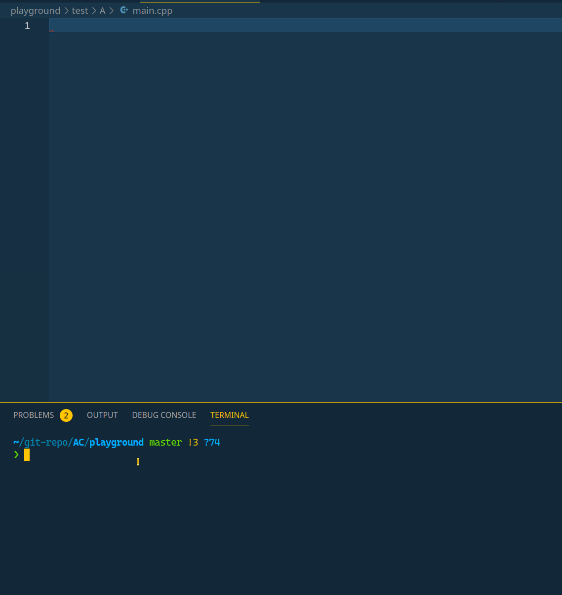

# My Coding Practice

## Current

* [my leetcode](https://leetcode.com/sky_io/), only taking contests now.
* [my codeforces](https://codeforces.com/profile/sky_io), mainly practice on codeforces.
* [google kickstart](https://codingcompetitions.withgoogle.com/kickstart), for later
  * [ ] [2020](https://codingcompetitions.withgoogle.com/kickstart/archive/2020)
  * [ ] [2019](https://codingcompetitions.withgoogle.com/kickstart/archive/2019)
  * [ ] [2018](https://codingcompetitions.withgoogle.com/kickstart/archive/2018)
  * [ ] [2017](https://codingcompetitions.withgoogle.com/kickstart/archive/2017)

## 目录说明

* [Algorithms](./Algorithms)目录下存放算法&数据结构 Algorithms & Data Structures
* 语言相关笔记，以及模板在[notes](./notes)目录下
* 不同网站oj的刷题存在相应网站域名命名的文件夹下

## LINKS

### algo / tutorial

* [topcoder: Competitive Programming Tutorials](https://www.topcoder.com/community/competitive-programming/tutorials/)
* [E-Maxx Algorithms in English](https://cp-algorithms.com/)
* [web.ntnu.edu.tw/~algo](http://web.ntnu.edu.tw/~algo/)
* [labuladong 的算法教程](https://labuladong.gitbook.io/algo/)

### template

* [Jinkela-Xiao-Zuan-Feng-Mountaineer/Codebook](https://github.com/Jinkela-Xiao-Zuan-Feng-Mountaineer/Codebook)
* 我的[vscode cpp snippets](https://github.com/sky-bro/.dotfiles/blob/master/.config/Code/User/snippets/cpp.json)
  

### problems

* [50题（ACM学习推荐题）](https://blog.csdn.net/jiangX1994/article/details/38019519)
* [AcWing在线题库](https://www.acwing.com/problem/)
