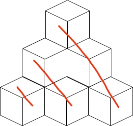

* `row`: the level of boxes
* `base`: number of boxes on the floor, `next_base = cur_base + (row + 1)`

1. we add a level of boxes (`sum += base`) at each loop, till sum greater than or equal to n. (if now sum equals n, just return `base`)
2. now we try to remove a box from the `base` at each loop (the boxes on the floor) till sum is less than n (our answer is inside `(pre_base, base)`), then return `base + 1`. Each time we remove a box from base, we need to remove a row of boxes marked in red line.

    
